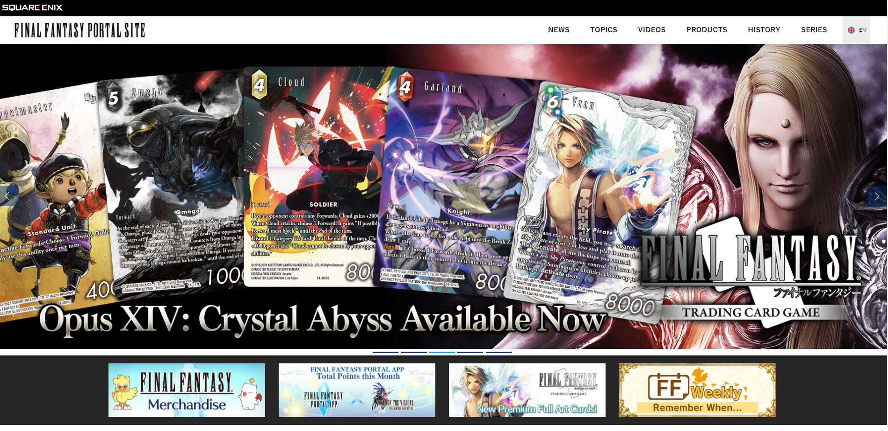
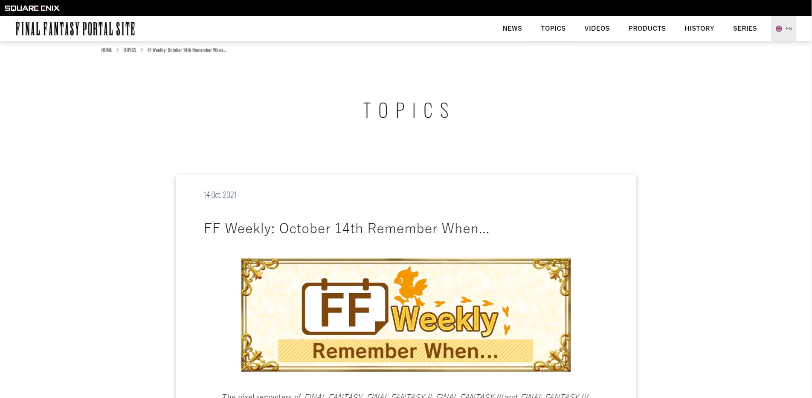
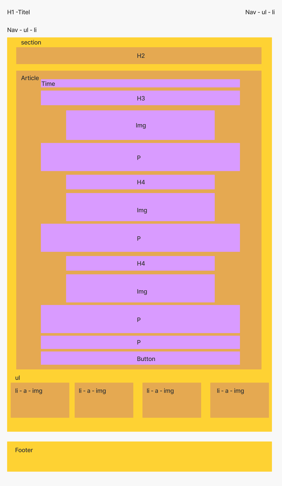
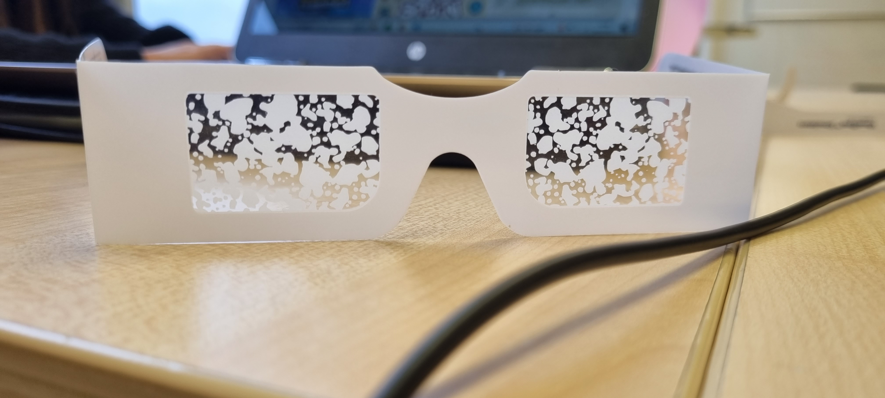

# Procesverslag

Markdown is een simpele manier om HTML te schrijven.  
Markdown cheat cheet: [Hulp bij het schrijven van Markdown](https://github.com/adam-p/markdown-here/wiki/Markdown-Cheatsheet).

Nb. De standaardstructuur en de spartaanse opmaak van de README.md zijn helemaal prima. Het gaat om de inhoud van je procesverslag. Besteedt de tijd voor pracht en praal aan je website.

Nb. Door _open_ toe te voegen aan een _details_ element kun je deze standaard open zetten. Fijn om dat steeds voor de relevante stuk(ken) te doen.

## Jij

uitwerken voor kick-off werkgroep

### Auteur:

Roshnie de Groen

#### Je startniveau:

Rood

#### Je focus:

Responsive

In week 4 ben ik van surface plane naar responsive overgestapt, omdat ik onbewust mijn site al responsive probeerde te maken. Ik wilde dat mijn site goed kon meeschalen en toen pas besefte ik me dat ik mij dan net zo goed op responsive kan focussen i.p.v. de surface plane.

## Je website

uitwerken voor kick-off werkgroep

### Je opdracht:

https://eu.finalfantasy.com/
https://eu.finalfantasy.com/topics/314
Ik wilde oorspronkelijk https://eu.finalfantasy.com/topics/306 doen, maar de website bestaat niet meer.

#### Screenshot(s) van de eerste pagina (small screen):

Voorpagina van eu.finalfantasy.com

#### Screenshot(s) van de tweede pagina (small screen):

Topic pagina van 14 october 2021  

## Breakdownschets (week 1)

uitwerken na afloop 2e werkgroep

### Eerste pagina:

### Tweede pagina:

## Voortgang (week 1 zonder gesprek)

geen voortgang gesprek deze week

### Stand van zaken

Ik heb deze week mijn website gekozen. De website is finalfantasyxiv.com. Eerst heb ik mijn HTML geschetst in de les, vervolgens heb ik dit in vs code uitgewerkt en heb hiermee de basis voor mijn HTML opgezet.

Wij hebben deze week les gekregen in flexbox. Vorig jaar heb ik dit veel gebruikt, dus veel informatie was herhaling. Ik vond de les wel nog handig, omdat dat ook een paar dingen waren die ik niet zo goed wist, bijvoorbeeld hoe ik makkelijk een respsonive menu kan maken. Ik vond de filmpjes heel leerzaam en erg interessant. Soms merkte ik bij mezelf dat er wel iets van flexbox was afgezakt, maar door het weer te herhalen werd het helemaal weer duidelijk. Ik heb daarom ook deze week meer filmpjes gekeken dan ik eigenlijk moest doen.

Als resultaat heb ik net iets te weinig tijd over gehouden om al het huiswerk te maken voor donderdag (vormgeving en FED vallen allebei op dezelfde dagen), ik zal er dus deze week en in het weekend verder aan moeten werken.

## Voortgang gesprek 1 (week 2)

uitwerken voor 1e voortgangsgesprek

### Stand van zaken

Ik was er deze les niet, dus was ik niet aanwezig (ziek) bij het gesprek.

Ik heb deze week een kleine begin gemaakt voor mijn hamburger menu, alleen kwam ik er niet helemaal uit. Ik loop een beetje achter op het huiswerk, maar er is deze week een hamburger menu opdracht dus zal ik dat als referentie materiaal gebruiken.

Deze week ben ik niet aanwezig geweest voor het voortgangsgesprek, omdat ik mij niet goed voelde

### Agenda voor meeting

Agenda voor de meeting is op dit moment n.v.t., omdat ik er deze week niet was.

### Verslag van meeting

- Ik was er deze les niet dus bij deze staat dit hier niet bij.

## Voortgang 2 (week 3)

uitwerken voor 2e voortgang

### Stand van zaken

Ik heb deze week verder gewerkt aan mijn hamburger menu. Ik weet nog niet helemaal hoe ik de afbeelding als header ga gebruiken en of ik dit wel ga doen. Misschien laat ik de afbeelding eruit en vervang ik het gewoon met tekst.

### Agenda voor meeting

Onze agenda is eenvoudig: we gaan elk student af en vragen met welke problemen zij zitten en hoe ver zij zijn.

### Verslag van meeting

Ik had problemen, wanneer ik een afbeelding in mijn HTML toevoegde. Gelukkig is dit probleem verholpen tijdens het voortgang gesprek, alleen staan soms elementen voor mijn button in mijn hamburger menu. Er werd gezegd dat ik gewoon iets element moet plaatsen en dan kijken hoe dit reageert op mijn bestand, dus dat zal ik volgende week doen. Daarnaast ben ik erachter gekomen dat ik mijn h1 img in mijn h1 gewoon kan plaatsen met dezelfde alt tekst die staat afgebeeld op de img i.v.m. accesibility. Ik heb nog best veel te doen dus ik zal de komende weken hier harder aan moeten werken, vooral omdat ik nu nog steeds met mobiel bezig ben..

## Toegankelijkheidstest (week 4)

uitwerken na test in 8e voortgang

### Bevindingen

Lijst met je bevindingen die in de test naar voren kwamen:

1. Begint met de content, maar slaat de main element over
2. Ziet het hamburger menu niet. Ik denk dat het komt, omdat ik in mijn javascript heb geschreven dat je het hamburger menu in het begin niet zichtbaar in beeld is. Ik zou dit op dezelfde manier kunnen oplossen, maar dan zie je wel als eerst het hamburger menu als je op de pagina komt.
3. Sommige afbeeldingen zijn niet duidelijk te begrijpen in de alt tekst, tenzij je misschien een fan bent van Final Fantasy. De oplossing is om de alt tekst aan te passen en als eerse "afbeelding van" in de alt tekst te zetten. Ik heb dit ook aangepast in mijn ontwerp.
4. Mijn pagina is nog goed te zien voor diegene die kleurenblind zijn.
5. Door de diabetes bril waren sommige letters wat moeilijker te lezen, met name de kleinere letters.

#### Begint met de content van de pagina

Het was in het begin ontzettend verwarrend, omdat heel veel van de pagina werd geskipped, zoals de nav, de header. De screenreader begon gelijk met de content (news, topics, video, sns) maar skipte tekst in de main tag en de headings.

#### Hamburger menu blijft "onzichtbaar" voor de screenreader

Het hamburger menu werd altijd overgeslagen. Ik heb javascript gebruikt om mijn hamburger menu te verbergen van het zichtbare scherm. Mijn vermoeden is dat de screenreader daarom mijn hamburger menu niet ziet.

Een oplossing zou kunnen zijn dat het hamburger menu zichtbaar is in het begin, waardoor de screenreader deze wel zal zien of de gebruiker gebruikt de website op desktop, dan is het hamburger menu niet eens nodig.

#### De "alt" tekst van advertentie afbeeldingen zijn niet duidelijk genoeg

Ik heb de tekst dat op advertentie afbeeldingen stond in mijn alt tekst geschreven. Voor mijn buurvrouw waar ik mee in de klas heb getest, was het zeer onduidelijk wat er werd opgenoemd.

Ik heb dit probleem verholpen door in de alt tekst van elke afbeelding "afbeelding van.." gezet. Hierdoor zou het duidelijker voor de gebruiker moeten zijn dat het om een afbeelding gaat over het gene dat verder in de alt tekst staat.

#### Kleurenblindheid is geen probleem

In de les hebben wij getest met een geel brilletje. Alles was hier nog duidelijk in te zien. Hiervoor is geen oplossing nodig.

#### Kleinere letters zijn moeilijker te lezen met de "biabetes bril"

Doordat er op sommige delen van de pagina een kleiner lettertype is gebruikt, is dit soms wat moeilijker te lezen op de diabetes bril.

De oplossing hiervoor zou zijn om het lettertype te vergroten. Dit heb ik dan ook vooral bij de 2e pagina aangepast.

## Voortgang 3 (week 4)

uitwerken voor 3e voortgang

### Stand van zaken

Deze week heb ik geprobeerd om aan mijn grid te werken en aan een carousel. Het lukte niet helemaal dus heb ik gevraagd in het feedback gesprek hoe ik dat misschien het beste kan doen.

### Agenda voor meeting

Deze week gaan we per student af wat iemand heeft gedaan en vragen waar wij hulp bij nodig hebben.

### Verslag van meeting

Er werd gezegd dat ik al mijn plaatjes in een section kan doen en de img een vw van 100% kan geven. Soms werkte het niet even mee met vw en dat heb ik ook nagevraagd. Er werd gezegd dat dit kan komen, doordat chrome misschien te veel is ingezoomed of niet. Uiteindelijk werkte het wel. Vervolgens moet ik mijn sections een vw van 300 geven met overflow:hidden.

Ik heb ook nog gevraagd over mijn h2 in mijn sections en ik moet deze eigenlijk uit mijn sections halen, zodat ik de h2 over de hele breedte van de pagina kan zetten.

Deze week liep ik helemaal vast met grid. Er werd toen gezegd dat als het mij echt niet lukt, dat ik het dan kan oplossen met flexbox wrap in plaats van grid.

Mocht ik nog feedback willen krijgen voor het mondeling, dan zou ik dat altijd kunnen aangeven.

Ik heb deze week

## Eindgesprek (week 5)

uitwerken voor eindgesprek

### Stand van zaken

Ik heb mijn twee pagina's nog niet af. Ik heb gedeeltelijk mijn CSS opnieuw geschreven, omdat ik het super rommelig vind. Ik vind het gebruik van "nth-of-type" selectoren helemaal niet praktisch. Als je iets in je HTML veranderd, moet je soms elk nummer van je "nth-of-type" selecor veranderen. Dit kost veel tijd en hierdoor wordt mijn werk ontzettend onoverzichtelijk. Soms is het hierdoor moeilijk om problemen achter te halen. Het is makkelijk om hiervoor de inpsect tool te gebruiken in je browser, maar dit betekent dat je code dan niet duidelijk genoeg is. Ik vind dit wel erg jammer omdat het me geen good-practice lijkt, alleen omdat we geen classes mogen gebruiken. Aan de ene kant snap ik het ook wel, omdat we anders misschien sommige selectoren zoals "nth-of-type" of " first-of-type" anders misschien wel helemaal niet zouden kennen.

Tijdens het gespreek is ook nog gezegd dat ik mijn carousel pas helemaal op het laatst mag doen of zelfs weglaten.

Ik ga dus voor de herkansing en hieronder zullen de screenshots staan van mijn uiteindelijke resultaat.

### Herkansing

De tweede pagina was veel makkelijker te maken. Ik heb wel echt classes hiervoor moeten gebruiken, omdat ik de styling van mijn tweede pagina anders moest maken dan de eerste pagina. Ik heb later in het proces ook veel meer dingen van de pagina weg gelaten, om de opdracht wat makkelijker voor mezelf te maken (ik heb momenteel meer dan 600 lines aan CSS code).

Ik heb het gevoel gehad tijdens deze opdracht dat ik wel veel meer beperkt moest werken, juist doordat ik minimaal classes en divs mag gebruiken. Met deze opdracht ben ik erachter gekomen, dat het gebruik van CSS selectoren, zoals "nth-of-type" niet praktisch is. Ook ben ik erachter gekomen hoe ik een "back to top" button kan maken en hoe ik een button kan linken aan een andere HTML pagina, i.p.v. een anchor element te gebruiken. Ik heb deze opdracht geleerd hoe ik een hamburger menu kan maken en hoe ik grid kan gebruiken.

Verder vond ik het testen van mijn website op een screenreader interessant. Ik denk dat ik dit vaker ga doen, omdat het een hele andere ervaring is van je website.

### Screenshot(s)

hier screenshot(s) van je eindresultaat

Eerste pagina:

Tweede pagina:

## Bronnenlijst

continu bijhouden terwijl je werkt

Nb. Wees specifiek ('css-tricks' als bron is bijv. niet specifiek genoeg).

1. https://eu.finalfantasy.com/ als inspiratie voor mijn hele website
2. https://eu.finalfantasy.com/topics/314 https://eu.finalfantasy.com/topics/314
3. https://css-tricks.com/snippets/css/a-guide-to-flexbox/ vaak gebruikt als ik iets vergeten was met flexbox
4. https://www.codegrepper.com/code-examples/css/gradient+border+bottom+css ik kwam niet uit hoe ik mijn gradient border bottom moest doen.

